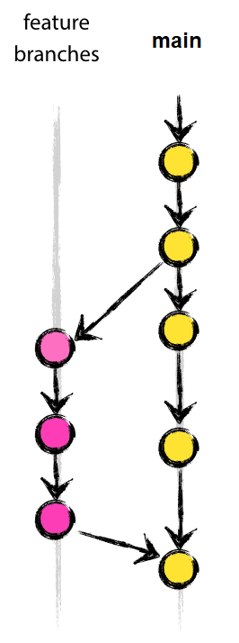

# Collaborating on research software

**Steps**
- Define your collaboration needs
- Define your workflow
- Document your workflow

---

## How much Git is necessary?

**Simple personal projects**
- Typically start with just the `main` branch.
- Use branches for unfinished/untested ideas.
- Use branches when you are not sure about a change.
- Use **tags** to mark important milestones.

---

**Projects with few persons: *you accept things breaking sometimes***
- It might be reasonable to commit to the main branch and feature branches.  

**Projects with few persons: *changes are reviewed by others***
- The `main` branch is write-protected.
- You create new feature branches for changes.
- Changes are reviewed before they are merged to the `main` branch.

---

**When you distribute releases**
- If you want to patch releases, you probably need release branches.
- The `main` branch is read-only.
- You may need a `develop` branch for active development
- Many [branching models](https://coderefinery.github.io/git-branch-design/05-branching-models/) exist.

In these slides, we will introduce the GitFlow branching model.

---

## Basic workflow

- `main`
    - The integration branch for feature work (default branch).
    - Indefinite lifetime
- `feature-<name-of-feature>`  
    - Branch used for specific feature work or improvements.
    - Short/long lifetime

---

## Protected production branch

- `main`
    - Used for deploying a release.
    - Use tags to track software versions.
    - Protected branch, requries approved pull requests
    - Indefinite lifetime
- `develop`
    - The integration branch for feature work.
    - Indefinite lifetime
- `feature-<name-of-feature>`  

---

## Additional supporting branches

- `hotfix-<name-of-issue>`
    - Used to quickly fix `main` without interrupting changes in the `development`.
    - Short lifetime

---

## Additional supporting branches

- `release-<version>`
    - Used to prepare a new production release.
    - Allow minor bugfixes and preparing metadata.
    - Short lifetime
- `bugfix-<name-of-issue>`
    - Typically used to fix release branches.
    - Short lifetime

---

