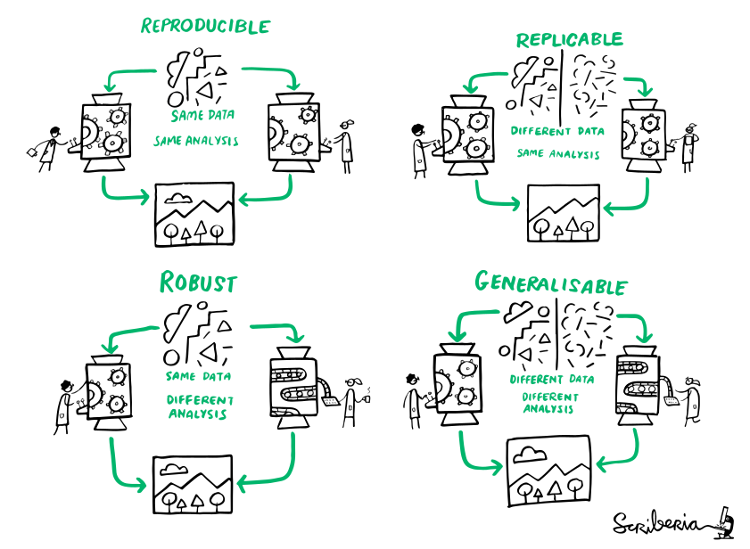
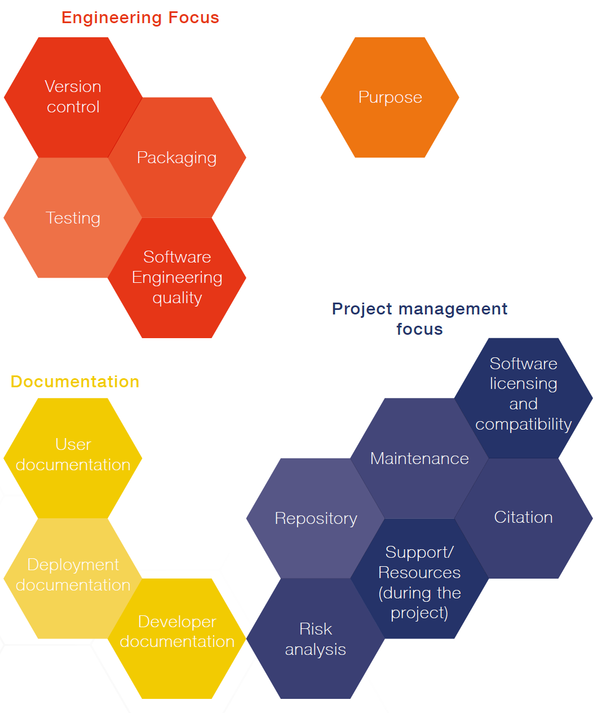

<!-- paginate: false -->
  
 # **FAIR4RS and Software Management Plans**

**TU Delft** - [Digital Competence Centre](https://dcc.tudelft.nl)

*These slides were made with [Marp](https://marp.app/).*

---

<!-- paginate: true -->

# **Topics**

- What is FAIR for research software?
- What is a Software Management Plan?
- Why and when is it useful?
- How do I get started?

---

# An all too common problem...

_Remember, your past self can also be the previous developer..._

---

# Definition of Research software

Research Software includes source code files, algorithms, scripts, computational
workflows and executables that were created during the research process
or for a research purpose. 

*Software components (e.g., operating systems, libraries, dependencies, packages, scripts, etc.) that are used for research but were not created during or with a clear research intent should be considered software in research and not Research Software.* 

---

# A scary anekdote

- A group of researchers obtain great results and submit their work to a high-profile journal.
- Reviewers ask for new figures and additional analysis.
- The researchers start working on revisions and generate modified figures, but find inconsistencies with old figures.
- The researchers can’t find some of the data they used to generate the original results, and can’t figure out which parameters they used when running their analyses.
- The manuscript is still collecting dust in a drawer …

---

# **FAIR for Research Software**

**Findable:** registry (Citation File)

**Accessible:** publishing/archiving (GitHub, Zenodo)

**Interoperable:** integration with other software/hardware (containerization, dependencies)

**Reusable:** software quality, documentation, testing, modular coding, Continuous Integration, ...

*All quite recent:*
[*14 October 2022 - Introducing the FAIR principles for research software*](https://www.nature.com/articles/s41597-022-01710-x)

---

# FAIR does not ensure reproducibility

>reproducibility refers to the ability of a researcher to **duplicate the results** of a prior study using the same materials as were used by the original investigator. That is, a second researcher might use the same raw data to build the same analysis files and implement the same statistical analysis in an attempt to yield the same results. Reproducibility is a **minimum necessary condition** for a finding to be believable and informative.
_U.S. National Science Foundation (NSF) subcommittee on replicability in science_

---

---

# Advantages of FAIR software

1. Track a complete history of your research (version control really is a _must_)
2. Facilitate collaboration and review process ([blog](https://quantumtinkerer.tudelft.nl/blog/demand-data-for-review/) Anton Akhmerov)
3. Publish validated research and avoid misinformation
4. Write your papers, thesis and reports efficiently
5. Get credits for your work fairly
6. Ensure continuity of your work

---

# **Software Management Plans**

A Software Management Plan (SMP) is a document that describes how a specific software project is **developed**, **maintained**, and **curated**. The goal of an SMP is to ensure that the software is usable and **maintainable** in the long term.

Recently, the a joint initiative of the Netherlands eScience Center and the Dutch Research Council (NOW) published a [Practical Guide to Software Management Plans](https://zenodo.org/record/7248877)

---

# Why and when are SMP's useful?
An SMP makes explicit what research software does, who it is for, what the outputs are, who is responsible for the release and ensures that the software stays available to the community (and for how long). It can help to:

- Explain why developing new software is necessary
- Make the research software reusable and sustainable
- Plan for necessary resources
- Allow for verification of work that went into software implementation

Ideally, an SMP should be draft at the beginning of a research project, but can be equally valuable for existing projects.

--- 

## Core requirements for an SMP

**Purpose**
What is the current reason or expected end-use for developing 
the software?

**Reliability**
The effect of software failure and/or non-maintenance on **risk of harm**, **reputation**, **research**.

**Maintenance**
The long-term effort needed to **maintain** the software as long as it might be used as a standalone tool or dependency.

---

## Example for medium management level

**Purpose**
Software is part of a research project or the primary research output. May be (re)used by others.

**Reliability**
Direct influence on researchers, good practices such as version control (Git) and user/technical documentation is essential.

**Maintenance**
This software’s functionality is useful to researchers both in and outside the project, making it suitable for distribution. It can have a lifespan longer than the project in which it was developed and therefore long-term sustainability becomes more important.

---

---
# **How do I get started?**

See assignment 3

:information_source: Don’t worry if you can’t fill all the topics, you can iterate over this draft as we move along the program based on the input from the seminars.